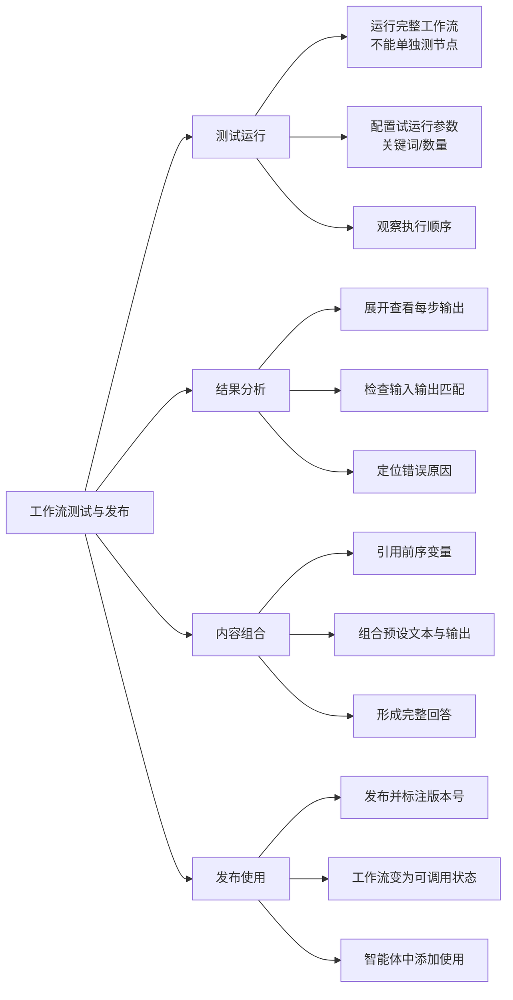

# 第4节 工作流测试与发布

### 📌 本节核心


### 📖 详细笔记

#### 一、为什么不能单独测试大模型节点？

我一开始以为每个节点都能单独测，结果发现大模型节点必须跑完整工作流。

原因很简单：大模型节点的输入来自前面的步骤。比如新闻搜索插件的结果，单独测大模型节点时根本拿不到这个输入，自然没法正常工作。

只有整个工作流跑起来，数据从前到后流转，大模型节点才能拿到真实的新闻内容做处理。

---

#### 二、试运行怎么配置？

##### 1. 设置演示参数

试运行时需要填一些默认值，让工作流跑起来有东西可处理：

- 选择一个关键词（比如"伊朗最新消息"）
- 设置返回数量（比如5篇）

##### 2. 观察执行过程

启动试运行后，能看到各个节点的执行顺序和输出状态。这一步很重要，能帮你确认流程是否按预期走。

---

#### 三、结果分析的方法

每个节点都有输出字段，可以展开查看具体内容。

如果输出不符合预期，排查思路是：

1. 检查当前节点的输入是什么
2. 对照前一步的输出是否正确传递
3. 定位是哪个环节出了问题

比如大模型总结的内容不对，先看传进去的新闻内容是不是完整的，再看提示词有没有写清楚。

---

#### 四、如何组合内容输出？

大模型处理完后，你可以在结束节点里做内容组合。

比如大模型已经把5篇新闻总结成一段摘要，变量名叫`summary`。你想在最终输出里加点引导语：

```
根据您的要求，以下是新闻搜索结果：

{{summary}}
```

这样就实现了**预设文本 + 动态输出**的组合，形成完整的回答。

---

#### 五、发布工作流

##### 1. 发布流程

配置好、测试通过后，点击发布。系统会要求填写版本号，方便追踪不同版本的更新。

##### 2. 发布后的状态

发布成功后，工作流会变成"可被智能体调用"的状态，通常会有绿色标记标识。

在智能体配置里，就能找到并添加这个工作流，让它为智能体提供服务。

---

### 💡 总结

1. 测试运行必须跑完整工作流，因为节点间有数据依赖
2. 结果分析要逐节点展开查看，定位问题从输入输出入手
3. 内容组合通过引用变量实现预设文本与动态输出的拼接
4. 发布后赋予版本号，工作流才能被智能体调用
---
