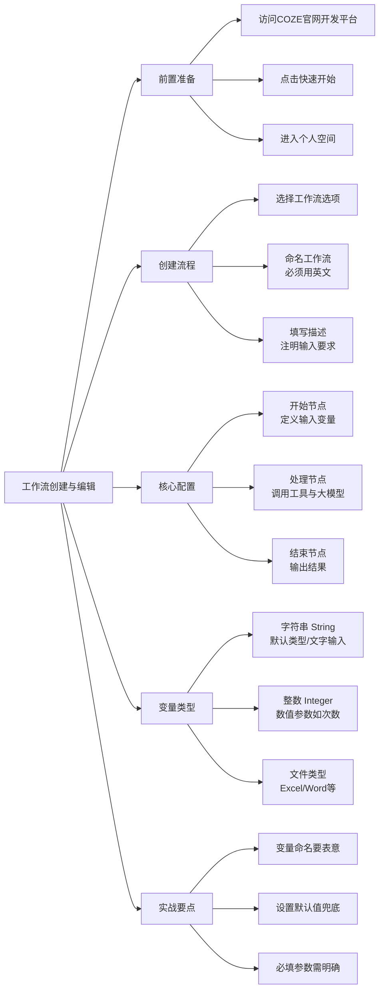

## 第1节 工作流创建与编辑

### 📌 本节核心

### 📖 详细笔记

#### 一、工作流

工作流就是给智能体写一份"操作说明书"。

比如你想让智能体帮你搜新闻然后总结，不能让它自己瞎发挥。你得提前规定好：先搜什么、用什么工具搜、搜完怎么处理、最后输出什么格式。这一套流程写下来，就是工作流。

**工作流 = 任务执行的可视化蓝图**

---

#### 二、创建工作流

##### 1. 开发平台

打开COZE官网，点扣子编程，在“资源”里找到资源库，然后右上角“+资源”里选择工作流。
##### 2. 创建并命名

在空间里选"工作流" → 创建。这里有个坑：**名称必须用英文**，我第一次用中文命名直接报错了。
描述部分建议写清楚需要用户提供什么输入，比如"需要输入搜索关键词"，方便以后复用时快速上手。

---

#### 三、编辑界面怎么用？

##### 1. 三个核心节点

- **开始节点**：定义输入变量，相当于函数的参数列表
- **处理节点**：调用工具获取数据，或者用大模型处理内容
- **结束节点**：输出最终结果

整个链路是线性的：输入 → 处理 → 输出，逻辑很清晰。

##### 2. 输入变量的配置技巧

变量名别随便起，用能表达功能的简短英文。比如接收搜索关键词的变量，叫`keyword`或`input`都比叫`a`强。

**默认值是个好东西**：设置之后，用户不填也能跑。我习惯设一个通用的默认值，比如在"查询值"里填默认值5，这样测试的时候不用每次手动输入，直接默认搜5个。

---

#### 四、变量类型怎么选？

##### 1. 字符串 String

默认就是它，接收文字内容。绝大多数场景用这个就够了。

##### 2. 整数 Integer

传数字用的。比如你设置每天爬取10个链接，这个"10"就需要用整数类型。我一开始用字符串传数字，结果后面处理的时候还要转换，多此一举。

##### 3. 文件类型

支持上传Excel、Word等。入门阶段暂时用不上，知道有这个功能就行。

---

#### 五、勾选必填还是非必填？

这个要看业务逻辑。

比如搜索任务，关键词是核心参数，没它就没法搜，那就设成必填。但像"返回结果数量"这种，可以设成非必填，配个默认值10条，用户不指定就按10条来。

**原则：缺了这个参数，任务还能不能正常跑？**

---

### 💡 总结

这节课主要是建立概念框架，知道工作流是什么、怎么创建、基本配置怎么填。主要就三点：

1. 工作流是智能体的任务执行蓝图
2. 变量命名要表意，默认值要合理
3. 必填参数根据业务逻辑判断
---
