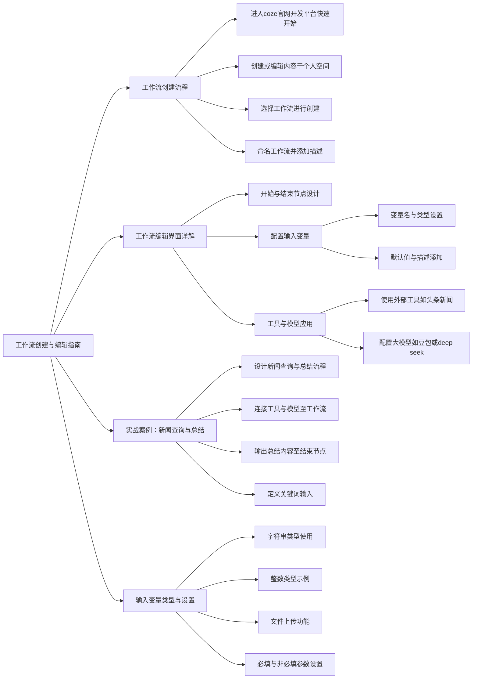

## 第1节 新闻搜索与总结

### 📌 本节核心

```mermaid
flowchart LR
    A[工作流创建与编辑指南] --> B[工作流创建流程]
    A --> C[工作流编辑界面详解]
    A --> D[实战案例：新闻查询与总结]
    A --> E[输入变量类型与设置] 
    B --> B1[进入coze官网开发平台快速开始]
    B --> B2[创建或编辑内容于个人空间]
    B --> B3[选择工作流进行创建]
    B --> B4[命名工作流并添加描述] 
    C --> C1[开始与结束节点设计]
    C --> C2[配置输入变量]
    C --> C3[工具与模型应用]
    C2 --> C2a[变量名与类型设置]
    C2 --> C2b[默认值与描述添加]
    C3 --> C3a[使用外部工具如头条新闻]
    C3 --> C3b[配置大模型如豆包或deep seek]
    D --> D1[设计新闻查询与总结流程]
    D --> D2[连接工具与模型至工作流]
    D --> D3[输出总结内容至结束节点]
    D --> D4[定义关键词输入]
    E --> E1[字符串类型使用]
    E --> E2[整数类型示例]
    E --> E3[文件上传功能]
    E --> E4[必填与非必填参数设置]
```

### 📖 详细笔记

#### 一、基本概念

##### 1.

##### 2.

#### 二、基本概念

##### 1.

##### 2.

#### 四、学习小结
- **基础层**：
- **优化层**：
- **应用层**：

### 💡 总结
---
