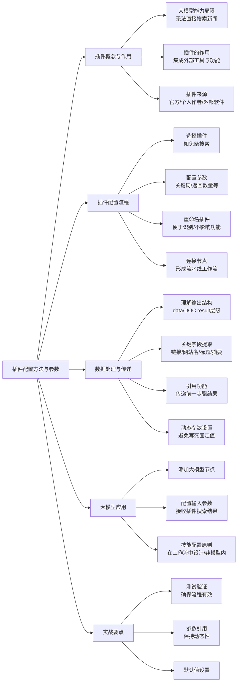

# 第2节 插件配置方法与参数

### 📌 本节核心

### 📖 详细笔记

#### 一、为什么需要插件？

学之前我以为大模型什么都能干，结果发现它连上网搜个新闻都做不到。大模型本身是封闭的，没有直接访问外部网络的能力。

**插件就是解决这个问题的关键**——它像一个"外挂工具箱"，把外部功能集成到大模型的工作流里。

比如你想搜新闻，可以加个"头条搜索"插件；想获取公众号文章，有专门的公众号文章获取工具；甚至像高德地图这样的外部软件，也能通过插件接入。

**插件 = 大模型的外部工具接口**

---

#### 二、插件配置的完整流程

##### 1. 选择合适的插件

以"头条搜索"插件为例，它有多个子功能，其中`search`功能可以用来获取网页内容。

选择插件时看两点：
- 功能是否匹配你的需求
- 是否有现成的扣子官方插件可用（优先选官方的，稳定性更好）

##### 2. 配置参数

每个插件都有特定的参数要求，需要根据说明人工配置。

比如头条搜索插件，常见参数包括：
- **关键词**：搜索的核心词
- **返回结果数量**：想要几条结果

这里有个坑：**参数名要写对**，不然插件跑不起来。建议先看一遍插件说明文档。

##### 3. 插件可以重命名

插件名称可以根据自己的习惯改，方便识别就行，对功能没有任何影响。我习惯把插件名改成能一眼看出功能的简短名称。

##### 4. 连接节点形成流水线

配置好插件后，要把各个节点连起来，形成类似工厂流水线的工作流程：

```
输入关键词 → 插件搜索 → 返回结果 → 大模型总结 → 输出
```

连接后记得点测试，验证整个流程是否能正常跑通。

---

#### 三、数据处理与传递的关键技巧

##### 1. 理解输出结构

插件的返回结果通常是嵌套的多层结构，比如：

```
data
  └── DOC result
        ├── 新闻链接
        ├── 网站名
        ├── 标题
        └── 摘要
```

需要关注的字段就这几个：**链接、网站名、标题、摘要**。不同插件返回的具体内容会有差异，但结构类似。

##### 2. 使用"引用"功能传递数据

这是个工作流设计的核心技巧：**不要把参数写死**。

比如你第一步设置了"返回5条新闻"，这个数量应该作为变量传递给后续节点，而不是在后面写死成固定数字。这样用户可以动态调整，传10条就返回10条，传3条就返回3条。

**原则：能用引用就用引用，保持工作流的灵活性**

---

#### 四、大模型节点的正确使用

##### 1. 添加大模型进行总结

搜索到新闻后，下一步是用大模型总结内容。

在工作流中添加大模型节点，选择合适的模型（如豆包1.5 pro），配置输入参数接收前一步的搜索结果。

##### 2. 技能配置的重要原则

这里有个坑：**不建议在模型节点内部配置插件**。

如果在模型节点里配插件，模型会"随机"选择使用哪个插件，结果不可控。正确的做法是：
- **在工作流层面设计好完整的流程**
- **每个节点只做一件事**
- **插件在外面单独配置，结果传给模型处理**

##### 3. 输入参数由用户决定

模型的输入参数应该由用户传入，而不是固定写死。比如搜索新闻数量，可以设一个默认值（如5条），用户可以随时调整。

---

#### 五、实战要点总结

##### 1. 测试是必须的

每连接一个新节点，都要测试一下。别等整个流程配完了再测，到时候出问题很难排查是哪个环节的锅。

##### 2. 参数引用保持动态性

- 搜索数量用引用传递
- 不要在中间节点写死固定值
- 让用户可以在开始节点控制全局

##### 3. 默认值的妙用

设置合理的默认值，比如：
- 新闻数量默认5条
- 关键词默认"AI新闻"

这样即使什么都不填，工作流也能跑起来，方便测试和演示。

---

#### 小结

这节课的核心是把插件"接"到工作流里，让大模型获得外部能力。

1. **插件配置**：选对插件、配好参数、连接节点
2. **数据传递**：理解输出结构、使用引用功能保持动态性
3. **模型使用**：在工作流层面设计流程，而非在模型内配置插件
---
