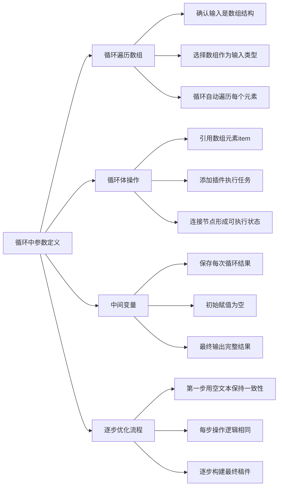

# 第2节 循环中参数的定义

### 📌 本节核心


### 📖 详细笔记

#### 一、循环遍历数组的配置

首先要确认输入的数据是数组结构，比如搜索新闻返回的链接列表。

配置循环时选择"数组"作为输入类型，循环会自动遍历数组中的每个元素，直到处理完所有元素后终止。

数组里有5个元素，就循环5次；有10个就循环10次。

---

#### 二、循环体内怎么操作？

循环体内部需要配置具体的处理逻辑。

##### 1. 引用当前元素

用`item`引用数组中的当前元素。比如`item.url`就是当前元素的链接字段。

##### 2. 添加插件节点

点击循环体，添加节点，选择"链接读取"插件。把`item.url`传给插件，就能获取当前链接的网页内容。

##### 3. 连接节点

确保循环体内部的节点连接正确，形成可执行状态。

##### 4. 配置输出

循环结束后，选择要输出的字段（如标题、内容），查看每次循环的结果。

---

#### 三、中间变量的作用

这是循环中最重要的概念。

中间变量用来保存每次循环的结果，并在下一轮循环中继续更新。

举个例子：你在写一篇新闻稿，循环处理5篇素材文本。

- 初始：中间变量为空
- 第1次循环：处理文本1，中间变量更新为"草稿1"
- 第2次循环：处理文本2，中间变量更新为"草稿2"（在草稿1基础上补充）
- ……
- 第5次循环：中间变量变成完整稿件

最终输出的就是中间变量的最终值。

---

#### 四、为什么第一步要用空文本？

我一开始不理解为什么初始要传空文本，后来想通了。

循环的本质是重复执行相同的操作。如果第一步直接处理真实文本，后面步骤的逻辑就要特殊处理，整个流程变得不统一。

用空文本作为初始值，从第二步开始才结合新内容，这样每一步的操作逻辑完全一致：

```
输入：中间变量 + 新文本
操作：合并更新
输出：新的中间变量
```

---

#### 五、逐步优化的完整流程

以写新闻稿为例：

1. 中间变量初始化为空
2. 循环处理每个文本素材
3. 每次循环：把新文本内容合并到中间变量
4. 循环结束后，中间变量就是完整稿件

这种方式特别适合需要"逐步构建"的任务，比如写作、代码生成、内容整合。

---

### 💡 总结

1. 循环遍历数组时，用item引用当前元素，添加插件执行具体操作
2. 中间变量保存每次循环的结果，初始为空，最终输出完整内容
3. 第一步用空文本保证循环逻辑一致性
4. 逐步优化适合需要累积构建的任务场景
---
