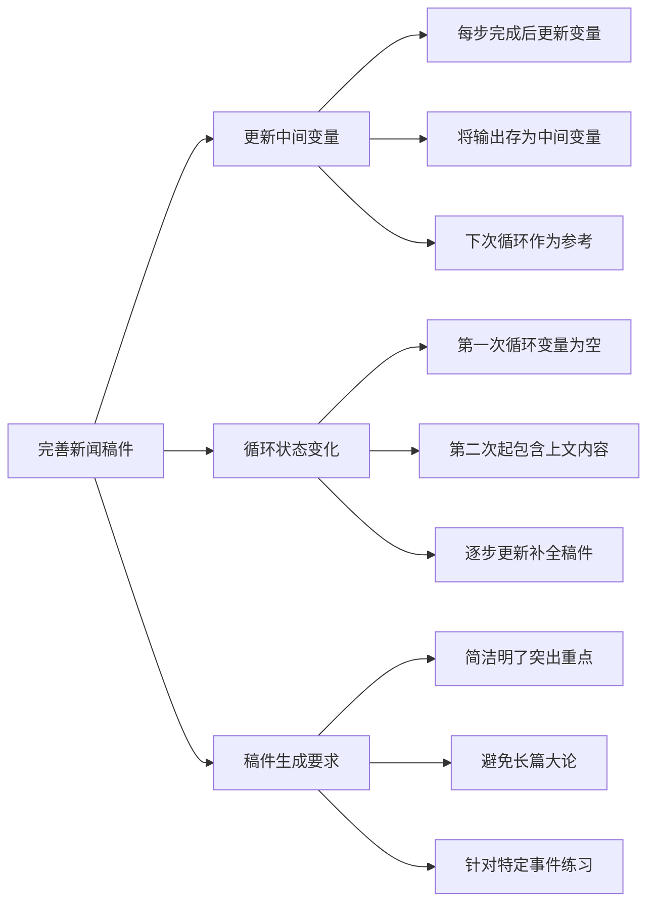

# 第3节 完善新闻稿件

### 📌 本节核心

### 📖 详细笔记

#### 一、为什么要更新中间变量？

每处理完一篇新闻素材，就要把结果存到中间变量里。

这样做的目的：让下一次循环能"记住"之前的内容，在此基础上继续补充。

中间变量就像一个草稿本，每次循环都在上面添砖加瓦，最终形成完整稿件。

---

#### 二、循环过程中变量的变化

以处理5篇新闻素材为例：

| 循环次数 | 中间变量状态 | 操作 |
|---------|-------------|------|
| 第1次 | 空 | 处理素材1，生成草稿1 |
| 第2次 | 草稿1内容 | 参考草稿1+素材2，生成草稿2 |
| 第3次 | 草稿2内容 | 参考草稿2+素材3，生成草稿3 |
| …… | …… | …… |
| 第5次 | 草稿4内容 | 参考草稿4+素材5，生成最终稿件 |

第一次循环时变量是空的，从第二次开始，变量里已经有了前面的内容。每次循环都是在"旧内容+新素材"的基础上生成新版本。

---

#### 三、稿件生成的要求

写新闻稿件时要注意：

- 简洁明了，突出重点
- 不要长篇大论
- 确保能说清现象概述、事件描述

建议先理解循环逻辑，从简单的事件开始练习，逐步掌握内容整合的技巧。

---

### 💡 总结

1. 每步完成后更新中间变量，存储结果供下次循环参考
2. 第一次变量为空，从第二次起包含上文内容，逐步补全
3. 稿件要简洁突出重点，从简单事件练习入手
---
