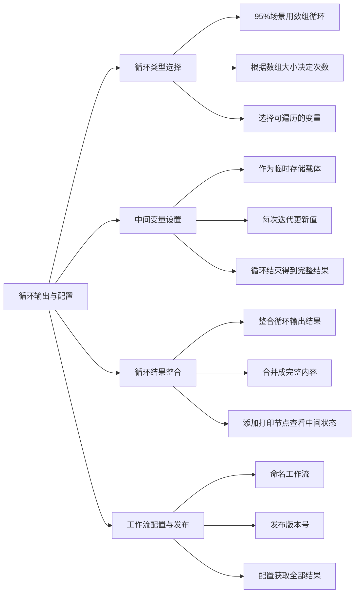

# 第4节 循环输出与配置

### 📌 本节核心

### 📖 详细笔记

#### 一、如何选择循环类型？

95%的场景用数组循环就够了。

数组循环的逻辑很简单：数组有几个元素，就循环几次。你只需要选择可遍历的变量，比如多篇文章组成的数组。

指定次数循环也有用武之地，但相对少见。

---

#### 二、中间变量什么时候用？

不是每次循环都需要中间变量。

但当你的任务是"累积构建"类型时，比如把多篇新闻整合成一篇报告，中间变量就派上用场了。

用法：每次循环更新中间变量，循环结束后，变量里就是完整结果。

例如设置一个叫"总结"的中间变量，每次循环把当前文章的摘要合并进去，最终得到完整的新闻报告。

---

#### 三、循环结果怎么整合？

循环结束后，输出结果（如`output`）需要整合成最终返回内容。

以新闻稿生成为例：每篇文章的摘要是循环的输出，最终合并成一份完整报告。

添加打印节点可以在循环过程中查看中间状态，确认流程按预期执行。

---

#### 四、工作流配置与发布

##### 1. 命名工作流

比如叫"summary"，方便识别功能。

##### 2. 发布版本

配置完成后发布，标注版本号，便于追踪和管理。

##### 3. 调用工作流

在智能体或其他地方调用已发布的工作流执行循环操作。

---

#### 五、如何获取全部结果？

默认情况下可能只获取到最后一个结果。

要获取全部新闻标题等内容，需要在配置时做相应设置。虽然稍微复杂，但能实现获取所有结果的目标。

每一步完成后引用输出，可以查看当前步骤的结果，便于调试和监控。

---

### 💡 总结

1. 大多数场景用数组循环，根据数组大小决定循环次数
2. 中间变量用于累积构建，每次循环更新，最终输出完整结果
3. 循环输出需整合，打印节点可查看中间状态
4. 发布工作流时标注版本号，配置时注意获取全部结果
---
