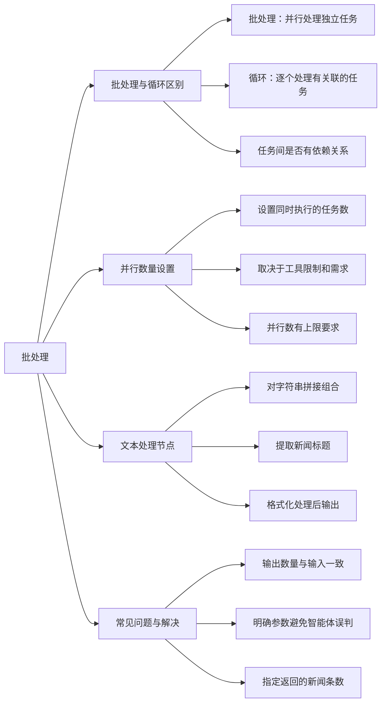

# 第5节 批处理的作用与效果

### 📌 本节核心

### 📖 详细笔记

#### 一、批处理和循环有什么区别？

选择使用循环或者批处理的判断标准很清晰：任务之间是否独立。

**批处理**：并行处理一组独立任务，每个任务互不依赖，各自完成各自输出。比如同时提取5篇文章的标题，互不影响。

**循环**：逐个处理，当前元素与下一个元素有关联。比如写新闻稿，每一轮都要参考上一轮的结果。

---

#### 二、并行数量怎么设置？

批处理可以设置并行数量，即同时执行几个任务。

比如设置并行数为4，就能同时对4篇文章提取标题。

但要注意：有些工具对并发数有上限要求，设置太高可能出问题。根据实际任务限制来调整。

---

#### 三、文本处理节点的作用

文本处理节点用于对字符串操作，比如拼接、组合。

在新闻标题提取场景中，它可以把标题和新闻内容按特定格式组合，再传给批处理继续处理。

每次处理对应一条新闻，输入N条新闻就输出N个标题。

---

#### 四、批处理的输出选项

批处理默认批量返回所有处理结果。

"end output"选项控制是否返回处理后的结果。循环可能允许自定义返回内容，比如选择中间变量或最终稿件。

---

#### 五、常见问题：数量不一致

我在实际操作中遇到过：输入5条新闻，只返回了最后1条标题。

问题出在参数设置。智能体的大模型判断与预期不符，没有正确返回所有结果。

解决方法：明确指定参数，告诉系统每次循环要返回几条新闻，不要让智能体自己猜。

---

#### 六、循环和批处理的应用场景

通过案例演示可以更直观理解：

- 批处理适合批量提取标题、批量获取内容等独立任务
- 循环适合逐步构建新闻稿、累积优化内容等有依赖的任务

两者配合使用，能高效处理复杂的多步骤流程。

---

### 💡 总结

1. 批处理适合独立任务并行处理，循环适合有依赖关系的逐个处理
2. 并行数量根据工具限制和需求设置，有上限要求
3. 文本处理节点用于字符串拼接组合，输出数量与输入一致
4. 数量不一致时明确指定参数，避免智能体误判
---
