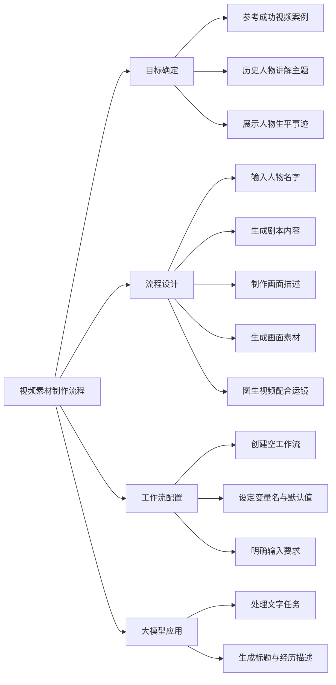

# 第1节 视频素材制作流程

### 📌 本节核心

### 📖 详细笔记

#### 一、视频素材制作的主要步骤

完整流程可以拆解为5个环节：

##### 1. 创建工作流

创建一个空的工作流，起个清晰的名字，比如"历史人物视频素材生成"。

##### 2. 编写剧本

输入历史人物名字，利用大模型生成剧本内容，包括标题和人物的生活经历描述。

##### 3. 制作画面描述

基于剧本，制作详细的人物画面描述，为后续图像生成做准备。

##### 4. 生成画面素材

根据画面描述，生成对应的图像素材。

##### 5. 图生视频

使用图生视频的方法，结合运镜技巧，把画面素材转化为视频片段。

---

#### 二、工作流配置要点

##### 1. 变量名设定

输入变量用`name`或`人物名字`，接收用户想生成视频的历史人物名称。

##### 2. 默认值

设置一个默认人物名字，比如"左宗棠"，方便测试和演示。

##### 3. 输入要求

在描述里写清楚：用户需要输入历史人物的名字。

---

#### 三、大模型在流程中的作用

大模型主要负责文字处理任务：

- 根据人物名字生成剧本标题
- 描述人物的生活经历
- 输出结构化的剧本内容

后续的图像生成和视频生成则需要调用其他工具完成。

---

### 💡 总结

1. 目标是制作历史人物讲解视频素材，先确定流程逻辑再动手
2. 完整流程：输入名字 → 生成剧本 → 画面描述 → 图像素材 → 图生视频
3. 工作流配置要设定变量名、默认值和输入要求
4. 大模型负责文字处理，图像视频需调用其他工具
---
