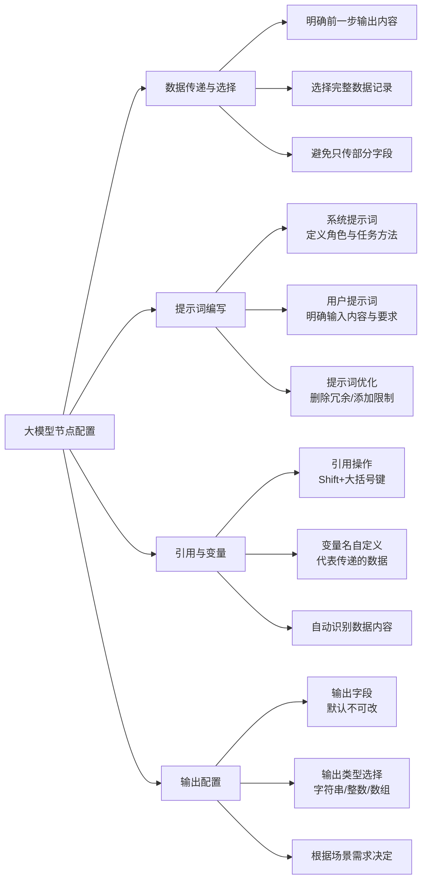

# 第3节 大模型节点配置

### 📌 本节核心


### 📖 详细笔记

#### 一、数据传递的核心思路

##### 1. 明确"传什么"给下一步

在配置大模型节点时，第一个问题不是"怎么配"，而是"前一步给了什么，我需要传什么"。

比如新闻搜索场景，插件返回了一堆字段：链接、网站名、标题、摘要……但你真正需要传给大模型的是完整的新闻记录，而不是某个单独字段或索引。

##### 2. 数据选择要看需求

根据任务目标选择合适的节点输出。比如要做新闻总结，就选第一步新闻搜索插件生成的完整记录作为输入。

有些场景可能需要特定能力的模型（如图像分析），但当前案例用不上，别过度配置。

---

#### 二、系统提示词 vs 用户提示词

这是配置大模型节点最核心的部分，很多人容易搞混。

##### 1. 两者的本质区别

| 类型 | 写给谁看 | 作用 |
|------|---------|------|
| 系统提示词 | AI系统 | 定义角色、制定任务执行方法 |
| 用户提示词 | AI的输入指导 | 明确输入内容是什么、怎么用 |

系统提示词关注"怎么做"，用户提示词关注"输入是什么"

##### 2. 系统提示词怎么写

两个要素：**角色定位 + 任务描述 + 限制条件**

```
角色：你是一个总结新闻的专家
任务：根据输入的新闻内容，总结成一句话，通俗易懂地解释事件的来龙去脉
限制：输出内容严格围绕用户输入的关键词，不延伸无关领域信息
```

##### 3. 用户提示词怎么写

明确告诉AI：输入的是什么，要怎么处理。

```
输入是新闻内容，请根据这些内容进行总结
```

##### 4. 提示词优化的坑

我一开始写提示词喜欢写得很全面，结果AI理解出岔子。后来发现：

- 删掉无关内容：不需要的工具说明、多余的条件都删掉
- 添加明确限制：比如"只回答新闻总结相关问题，拒绝回答其他问题"
- 一句话说清楚任务：别绕弯子

---

#### 三、引用操作的正确姿势

##### 1. 如何创建引用

按住 `Shift` + 点击大括号键（键盘字母P旁边），就能创建引用标记。

引用后，AI就能准确接收到你指定的输入内容。

##### 2. 变量名的含义

`input` 是一个变量名，代表从上一步传过来的数据。

你可以自定义变量名（如 ABCD、news_content 等），但一旦定义了，后面引用时必须保持一致。系统会自动识别并显示对应的数据内容。

变量名只是个代号，重要的是它代表的数据

---

#### 四、输出配置

##### 1. 输出字段的特点

输出字段（如 `output`）是系统预设的，一般不建议改。它用来存放处理后的结果。

比如大模型总结完新闻后，结果就存在 `output` 字段里。

##### 2. 输出类型怎么选

根据实际需求选择：

| 类型 | 适用场景 |
|------|---------|
| 字符串 String | 文本内容，如总结、描述 |
| 整数 Integer | 数值结果，如打分、计数 |
| 数组 Array | 多项数据，如视频剪辑列表 |

当前案例输出的是"新闻总结文本"，所以选字符串。

---

#### 五、系统提示词与用户提示词的配合

这是个工作流设计的核心逻辑：

1. 系统提示词：告诉AI"你是谁、怎么做"
2. 用户提示词：告诉AI"输入是什么、具体要求"
3. 引用操作：把前一步的数据"喂"给AI

三者配合，才能让AI准确理解任务并输出预期结果。

---

### 💡 总结

1. 数据传递：明确前一步输出内容，选择完整数据记录，避免只传部分字段
2. 提示词编写：系统提示词定义角色与方法，用户提示词明确输入与要求，删冗余加限制
3. 输出配置：输出字段默认不改，类型根据场景选择
---
