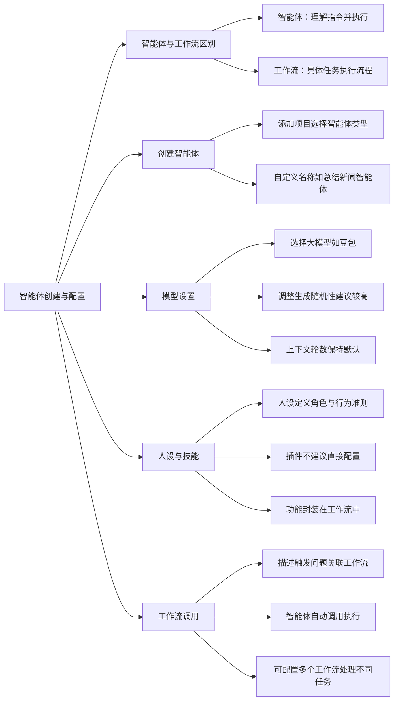

# 第5节 智能体创建与配置

### 📌 本节核心


### 📖 详细笔记

#### 一、智能体

智能体和工作流到底什么关系呢，我觉得可以用一个类比理解：

**智能体像秘书，工作流像操作手册**

秘书（智能体）负责理解你的需求，然后翻手册（工作流）执行具体操作。

- 你说"帮我总结一下伊朗最近的的新闻"
- 秘书听懂了，翻开"新闻总结手册"
- 按手册步骤：搜索新闻 → 大模型总结 → 输出结果

应用则是一个可视化界面，用户点按钮操作智能体。

---

#### 二、创建智能体的流程

##### 1. 添加项目

在项目开发中添加新项目，选择"智能体"应用类型。

##### 2. 命名智能体

名称自定义，比如"总结新闻智能体"。名字要能看出功能，方便以后管理。

---

#### 三、模型设置的关键参数

##### 1. 选择大模型

默认用"豆包"通用模型，有特殊业务需求可以换其他模型。

##### 2. 生成随机性

这个参数决定回答的多样性。建议设高一点，避免每次回答都一模一样。

##### 3. 上下文轮数

控制智能体能参考多少轮之前的对话。没有特殊需求就保持默认。

---

#### 四、人设的作用

人设就是给智能体立规矩。

比如你设置它"只负责总结新闻"，那用户问"讲个笑话"，它会直接说不知道。这样能避免智能体乱答，保持专业性。

人设写法示例：

```
你是一个新闻总结助手，只回答与新闻内容总结相关的问题，其他问题请回复"我不知道"。
```

---

#### 五、插件要不要配？

一般不建议在智能体里直接配插件。

原因是智能体会随机使用插件，流程不可控。更好的做法是把所有功能封装在工作流里，让智能体调用工作流。

特殊情况：如果确实需要智能体直接访问某个API（如查询天气），可以在技能部分配置，但这属于少数场景。

---

#### 六、如何让智能体调用工作流？

##### 1. 添加工作流

在智能体设置里添加已发布的工作流，比如"get news"。

##### 2. 描述触发条件

告诉智能体：用户问什么问题时调用哪个工作流。

```
用户问题：帮我总结一下伊朗最最近的新闻
调用工作流：get_news
```

##### 3. 配置多个工作流

智能体可以配置多个工作流，处理不同类型的任务：

- 问新闻 → 调用新闻总结工作流
- 问其他信息 → 调用对应工作流

智能体会根据用户输入自动判断该用哪个。

---

### 💡 总结

1. 智能体是理解需求的"秘书"，工作流是执行任务的"操作手册"
2. 模型设置中生成随机性建议调高，上下文轮数保持默认
3. 人设定义行为边界，避免智能体答非所问
4. 功能封装在工作流中，智能体通过描述触发条件调用
