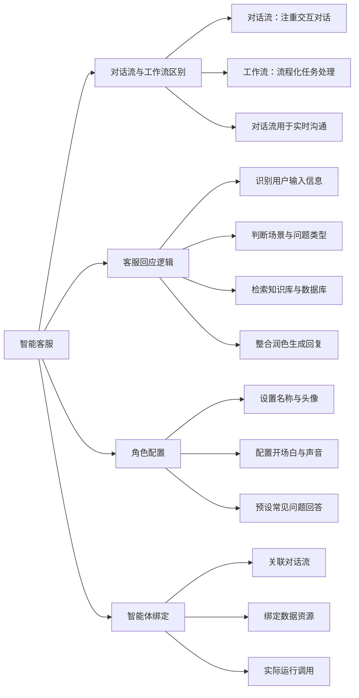

# 第1节 智能客服框架

### 📌 本节核心

### 📖 详细笔记

#### 一、对话流 vs 工作流

**对话流是聊天，工作流是做任务**

对话流注重与用户的交互和对话过程，像真人客服一样实时沟通、信息检索。

工作流侧重流程化的任务处理，按固定步骤执行操作。

智能客服主要用对话流，因为它需要根据用户输入实时回应。

---

#### 二、智能客服的完整逻辑流程

用户输入后，系统会按这个流程处理：

##### 1. 识别输入信息

首先识别用户买了什么商品、问了什么问题。

##### 2. 判断场景和问题类型

通过选择器等工具，判断用户是问售后问题、物流问题还是其他场景。

##### 3. 检索数据源

根据问题类型，在知识库、数据库里找匹配的答案。

##### 4. 整合回复

把检索到的信息整合润色，生成最终的客服回复。

整个流程有固定的逻辑，但回复内容根据用户输入实时生成。

---

#### 三、如何配置智能客服角色？

配置智能客服就像给一个人设人设：

##### 1. 基础信息

- 名称：比如"智能客服-xxx"
- 头像和背景图片
- 声音设置

##### 2. 开场白

设置欢迎语，比如"我是智能客服xxx，请问可以帮到你什么？"

##### 3. 常见问题预设

提前配置常见问题的回答，让用户能快速得到响应。

##### 4. 关联智能体

把配置好的对话流与智能体关联，绑定数据资源，这样实际运行时才能调用。

---

### 💡 总结

1. 对话流注重交互对话，适合智能客服；工作流注重流程化任务处理
2. 客服回应逻辑：识别输入 → 判断场景 → 检索数据 → 整合回复
3. 角色配置包括名称、头像、开场白和常见问题预设
4. 对话流需与智能体关联，绑定数据资源才能实际运行
---
