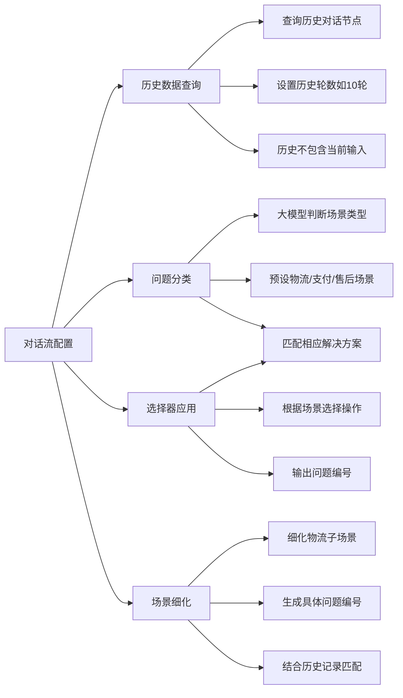

# 第2节 对话流配置

### 📌 本节核心

### 📖 详细笔记

#### 一、为什么先查询历史对话？

智能客服需要了解之前的聊天内容，才能提供更准确的回复。

##### 1. 查询历史对话节点

添加"查询历史对话"节点，传入历史对话的名字。

##### 2. 设置历史轮数

比如设置最多携带10轮对话，太多的话会影响性能，太少又有可能缺少关键信息。

##### 3. 当前输入不包含在历史里

历史记录只显示之前的对话。比如第一次查询可能为空，第二次查询会包含第一次的"你好"。

---

#### 二、历史记录与当前对话如何结合？

把当前用户输入和历史记录一起传给后续节点处理。

这样场景分类和问题解答时，既能了解用户刚才说了什么，也能知道之前聊了什么。

---

#### 三、问题分类怎么做？

用大模型对问题进行分类，定义了三个不同的场景：

- 物流场景
- 支付场景
- 售后场景

重要的一点：输出结果必须限制在预设的几个场景分支里，不能生成不在工作流中的新场景。

---

#### 四、选择器的作用

选择器根据场景类型选择对应的操作：

| 场景 | 执行操作 |
|------|---------|
| 物流场景 | 执行物流相关操作 |
| 支付场景 | 执行支付相关操作 |
| 售后场景 | 执行售后相关操作 |

选择器会逐一检查条件，满足某个场景就执行该分支下的操作。

---

#### 五、场景细化怎么做？

以物流场景为例，可以细化为多个子场景：

- 发货配送时效
- 配送时长
- 物流进度

每个子场景对应一个详细的问题编号，根据这个编号查找相应的解决方案。

问题编号可以由数据库或AI模型根据用户输入和历史记录生成。

---

### 💡 总结

1. 查询历史对话要设置轮数，历史不包含当前输入
2. 问题分类用大模型，限制输出为预设场景分支
3. 选择器根据场景选择操作，输出问题编号
4. 场景细化建立子场景，生成具体问题编号匹配解决方案
---
