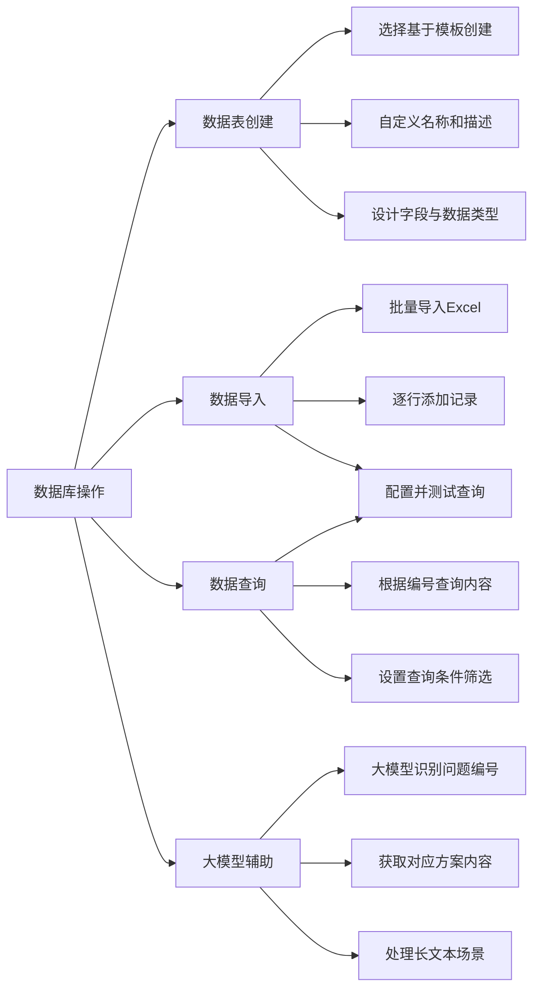

# 第3节 数据库操作

### 📌 本节核心

### 📖 详细笔记

#### 一、数据库像什么？

可以把数据库理解成一张Excel表。

通过匹配特定条件（比如问题编号），就能检索到相应的具体数据。

---

#### 二、查询数据前的准备

查之前得有数据。

如果数据库是空的，需要先创建数据。可以通过系统自动生成，或者手动导入。

---

#### 三、如何创建数据表？

##### 1. 选择模板创建

点击加号新建数据表，选择"基于模板创建"。

##### 2. 自定义名称和描述

比如名称叫"快递物流数据集"，描述写"存储快递物流相关问题的数据"。

##### 3. 设计字段

按照默认设置创建ID等字段，然后自定义需要的字段：

- 方案编号：字符串类型（string）
- 解决方案内容：根据需求选择类型

字段类型要和实际存储的数据格式匹配。

---

#### 四、如何导入数据？

两种方式：

- **批量导入**：上传Excel文件，系统自动识别字段
- **逐行添加**：手动输入每条记录，按字段顺序填入数据

如果数据量不大，逐行添加也够用。

---

#### 五、数据查询怎么配置？

##### 1. 设置查询条件

比如通过编号`number`等于某个值，查询对应的具体内容。

##### 2. 配置筛选和排序

可以选择只关注某个字段（比如"内容"），也可以根据需要排序。

但如果只查一个结果，排序不是必须的。

##### 3. 测试查询

复制查询条件，测试一下能否正确返回匹配的数据。

---

#### 六、大模型能帮上什么忙？

除了直接查询数据库，还可以用大模型辅助：

##### 1. 识别问题编号

大模型理解用户问题，提取出问题编号。

##### 2. 获取对应方案

根据编号找到相应的方案标题和内容。

##### 3. 处理长文本场景

对于内容较少的情况，可以让大模型直接处理长文本并给出答案。

但要注意，大量文本时大模型效率会变低，更适合用数据库查询。

---

### 💡 总结

1. 数据库类似Excel表，通过编号等条件查询数据
2. 创建数据表时选择模板，设计字段和类型
3. 数据可批量导入或逐行添加
4. 查询配置设置条件和筛选，测试确保正确
5. 大模型可辅助识别编号和获取方案，但大量数据用数据库更高效
---
