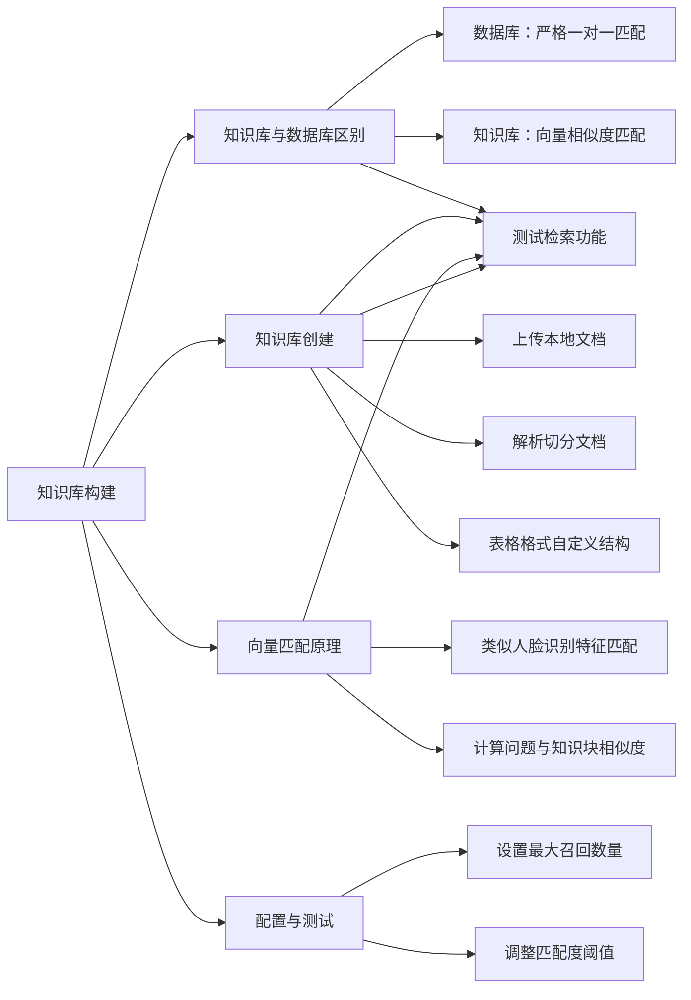

# 第4节 知识库构建

### 📌 本节核心

### 📖 详细笔记

#### 一、知识库和数据库有什么区别？

这是我一开始容易混淆的概念。

**数据库是严格的一对一匹配**，查询内容必须完全一致才能匹配上。

**知识库用向量匹配**，允许不精确，根据相似度找相关内容。

比如问"总经理是谁"，数据库必须查到"总经理"这个关键词，知识库能通过"公司介绍""董事长介绍"等相似内容推断出来。

---

#### 二、售后场景第一步做什么？

先获取一个方案，再基于这个方案进行知识匹配。

---

#### 三、如何理解向量匹配？

可以类比成人脸识别。

即使面部特征有细微变化，主要特征相似就能识别出来。知识库也是这个道理：问题表述不完全相同，但主要特征或描述相符，就能匹配到相关知识块。

---

#### 四、如何创建知识库？

##### 1. 文本格式创建

上传本地文档，通过工具解析和切分文档内容。

可以自定义提取和过滤条件，比如设定换行符（回车或逗号），调整知识块大小。

##### 2. 表格格式创建

上传Excel表，自定义表结构。

比如建立问题编号、问题内容、答案内容等字段，数据类型设为文本描述。

表格格式更精准，适合需要精确匹配的场景。

---

#### 五、知识库如何确定相关内容？

计算用户问题与各个知识块之间的相似度，选取相似度大于等于预设阈值的知识作为答案。

比如问"公司总经理的信息"，知识库会计算与公司介绍、董事长介绍、公司福利描述的相似度，把关联度高的部分呈现出来。

---

#### 六、如何测试知识库？

配置完成后点击测试按钮，输入具体问题，观察能否准确匹配到预期答案。

比如问"退换货需要满足哪些条件？"，看看返回的结果是否正确。

---

#### 七、召回数量和阈值怎么设置？

##### 1. 最大召回数量

决定匹配返回的最相关答案数量，根据知识库数据量自行设定。

##### 2. 匹配度阈值

控制匹配精准度。阈值越高，匹配要求越严格。

---

#### 八、索引是什么？

索引在知识库中扮演查找角色，帮助系统根据用户输入的问题编号快速定位到相似问题及其对应的答案。

用户输入的问题映射到预设的索引上，实现高效检索。

---

#### 九、数据库和知识库怎么选？

| 场景 | 推荐 |
|------|------|
| 精准匹配、数量级匹配 | 数据库 |
| 长文本内容检索 | 知识库 |

退换货条件匹配这类需要精准的任务，用数据库更合适。

---

### 💡 总结

1. 数据库严格一对一匹配，知识库用向量相似度匹配
2. 向量匹配类似人脸识别，通过特征相似度找相关内容
3. 知识库可上传文档或Excel表格，自定义结构和过滤条件
4. 设置召回数量和匹配度阈值，控制检索结果
5. 精准匹配用数据库，长文本检索用知识库
---
