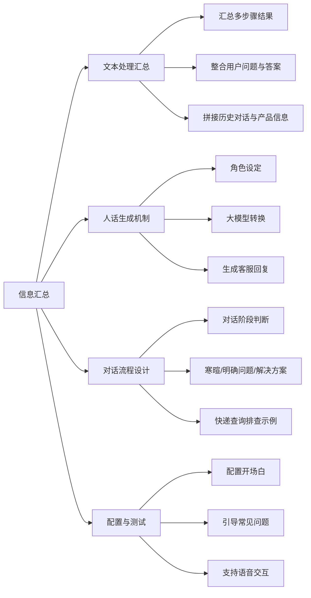

# 第2节 信息汇总

### 📌 本节核心

### 📖 详细笔记

#### 一、为什么需要汇总多个步骤的结果？

##### 1. 工作流产生多个数据源

在实际的客服场景中，我们不会只从一个地方获取信息。比如：
- 从知识库检索到的答案
- 从FAQ常见问题库匹配的内容
- 数据库查询的具体解决方案
- 产品相关信息

这些信息分散在不同节点，需要汇总到一起才能形成完整答案。

##### 2. 文本处理节点的核心功能

文本处理节点就像一个"信息组装器"，能够：
- 将来自不同来源的答案拼接在一起
- 整合用户的问题、匹配到的答案以及历史对话
- 把零散的信息变成一个完整的上下文

---

#### 二、汇总后为什么还要转人话？

##### 1. 初步汇总不够友好

文本处理只是把信息机械地拼接起来，比如：
> 用户问题：快递什么时候到？知识库答案：发货后3-5天。FAQ答案：偏远地区加2天。

这种拼接对用户来说不够自然，需要进一步处理。

##### 2. 大模型的角色：翻译官

大模型能够根据设定的客服角色，把技术性的汇总结果转化成易懂的人话：

**汇总结果**：
> 用户问题：快递什么时候到？答案：发货后3-5天，偏远地区加2天。

**人话转换后**：
> 亲~，您的快递一般在发货后3-5天就能送达呢。如果您在偏远地区，可能要多等2天左右哦~

这样用户听起来就舒服多了！

---

#### 三、如何设定客服角色？

##### 1. 角色描述要素

让AI生成符合客服角色的回答，需要包含：
- **称呼**：如"亲~"、"您好"
- **性格描述**：如友好、耐心、专业
- **服务态度**：如"我会尽力帮您解决问题"

##### 2. 实际操作

汇总完成后，在提示词中添加角色设定，然后让大模型生成最终的回复内容，最后将生成的回答复制粘贴到输出位置。

---

#### 四、对话流程如何智能判断？

##### 1. 三阶段处理逻辑

系统会根据用户的对话阶段采取不同行动：

| 阶段 | 判断依据 | 处理方式 |
|------|---------|---------|
| 寒暄阶段 | 用户只打招呼 | 友好回应，保持对话 |
| 明确问题阶段 | 用户提出具体问题 | 跳转服务指南，提供解决方案 |
| 深入交互阶段 | 用户连续提问 | 逐步筛选，精准匹配 |

##### 2. 快递查询排查示例

这是一个典型的逐步排查过程：

**用户**：快递什么时候到？
**系统**：您好，可以提供一下订单号吗？
**用户**：123456
**系统**：已为您查询到订单，从杭州发往北京，预计3-5天送达。
**用户**：今天能到吗？
**系统**：今天大概率到不了，预计后天送达。

演示中展示了系统如何根据用户的连续提问，逐步细化查询条件，最终找到匹配的答案。

---

#### 五、如何整合多维度信息？

##### 1. 信息来源

系统会同时整合以下信息：
- **产品信息**：商品属性、规格、价格等
- **当前用户输入**：用户这次问的问题
- **历史对话记录**：之前聊过的内容
- **匹配到的答案**：从知识库、FAQ、数据库等获取的解决方案

##### 2. 整合方式

通过文本处理节点，将所有相关信息拼接成一个完整的上下文字符串，然后传递给大模型进行人话转换。

---

#### 六、如何配置对话流？

##### 1. 配置开场白

设定友好的开场白，如"您好，我是客服小蜜，有什么可以帮您的？"

##### 2. 引导常见问题

预设用户常问的问题类型，如快递、支付、售后等，引导用户快速进入主题。

##### 3. 支持语音交互

允许用户自定义语音表达，实现个性化的客服交互体验。

##### 4. 自定义回复语

针对不同场景配置专门的回复模板，比如退换货、物流异常等。

---

### 💡 总结

汇总的流程是：信息汇总 → 人话转换 → 智能回复，确保用户得到既准确又友好的服务体验。
1. 文本处理节点负责汇总多个信息源
2. 大模型**负责将汇总结果转为人话
3. 对话流程需要根据不同阶段智能判断
---

